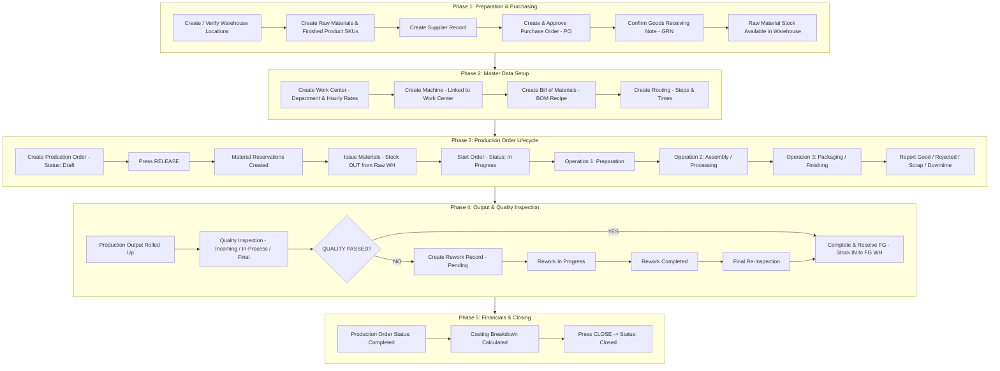
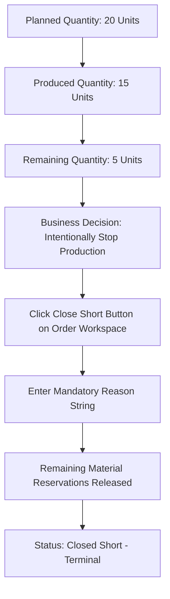
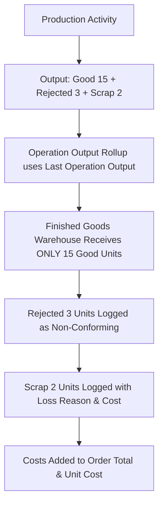
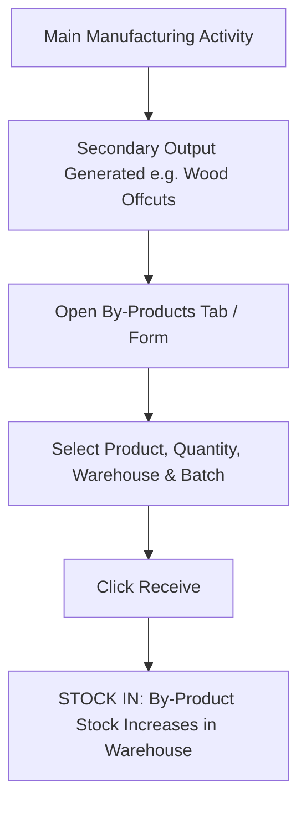
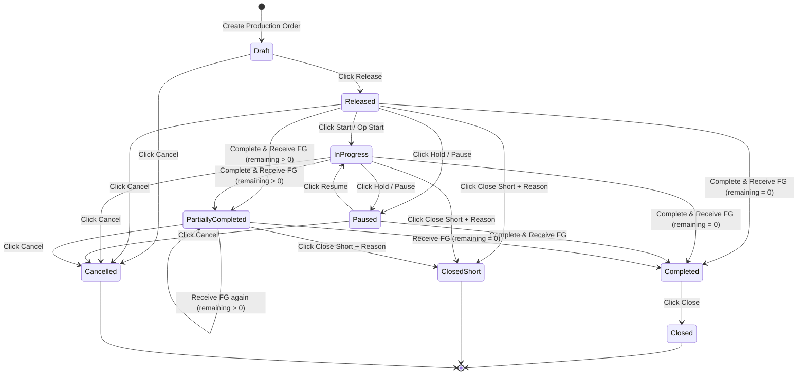

# Bisonstechs ERP — Manufacturing Process Flow & Visual Diagrams

**Module:** Manufacturing  
**App:** Bisonstechs ERP  
**Interactive UI Guide:** Available in app at `/manufacturing/guide`

---

## 1. Master Journey Diagram (End-to-End Happy Path)



---

## 2. Alternative Branch Diagrams

### 2.1 Branch Flow A: Partial Production Journey

```mermaid
flowchart TD
    P1[Planned Quantity: 20 Units] --> P2[First Production Output: Good = 15]
    P2 --> P3[Click Complete & Receive FG with Qty = 15]
    P3 --> P4[Produced = 15 | Remaining = 5]
    P4 --> P5[Status: Partially Completed]
    P5 --> P6[CRITICAL: Continue SAME Production Order]
    P6 --> P7[Second Production Output: Good = 5]
    P7 --> P8[Click Complete & Receive FG with Qty = 5]
    P8 --> P9[Produced = 20 | Remaining = 0]
    P9 --> P10[Status: Completed]
```

### 2.2 Branch Flow B: Close Short Journey



### 2.3 Branch Flow C: Scrap & Rejected Output Flow



### 2.4 Branch Flow D: By-Product Stock Receipt



---

## 3. Order Status State Transition Diagram



---

## 4. Simplified 30-Second Journey Map

```
1. PREPARATION   : Product ──► Supplier ──► PO ──► GRN ──► Stock Available
2. MASTER DATA   : Work Center ──► Machine ──► BOM ──► Routing
3. PRODUCTION    : Create MO ──► Release ──► Reserve ──► Issue ──► Operations
4. OUTPUT        : Good / Rejected / Scrap ──► Quality Inspection ──► (Rework if fail)
5. FINANCIALS    : Complete & Receive FG (Stock IN) ──► Costing Calculated
6. CLOSING       : Completed ──► Closed  (or Partially Completed / Close Short)
```
