# Bisonstechs ERP — Complete Manufacturing Module User Guide & Process Manual

**System:** Bisonstechs ERP  
**Module:** Manufacturing (Production · Quality · Costing · Materials · Master Data)  
**Target Audience:** Factory Managers, Production Operators, Warehouse Staff, Cost Accountants, System Administrators  
**Source of Truth:** Verified against actual backend logic (`/controllers/manufacturingController.js`, `/utils/manufacturingWorkflow.js`) and frontend implementation (`/app/manufacturing/...`).

---

## 1. Main Purpose & Overview

This user guide provides a complete, screen-by-screen, button-by-button operational manual for the Bisonstechs ERP Manufacturing Module. A brand-new ERP user can read this document and immediately understand:

* **Where manufacturing starts:** Raw material purchasing and warehouse stock verification.
* **What master data must be created first:** Products, Warehouses, Work Centers, Machines, BOMs, and Routings.
* **What should be purchased before production:** Raw materials must exist in physical stock before release/issue.
* **How raw material reaches warehouse stock:** Supplier → Purchase Order → Goods Receiving Note (GRN) → Stock IN.
* **When to create BOM:** Once for each manufactured product to define its recipe (WHAT material is needed).
* **When to create Routing:** Once for each manufactured product to define production steps (HOW it is made).
* **When Work Centers and Machines are required:** Before defining Routing operations and logging machine maintenance.
* **When to create Production Order:** When a specific manufacturing job is authorized (product, quantity, due date).
* **What Release does:** Calculates component requirements, creates stock reservations, spawns Work Orders per Routing operation, creates a WIP record, and changes status to `Released`.
* **What Materials Reservation does:** Temporarily holds required stock in the Source Warehouse so other jobs cannot consume it.
* **What Materials Issue does:** Physically removes raw material from the Source Warehouse (Stock OUT) and assigns it as `Issued` to the production job.
* **How Work Orders / Operations work:** Operators execute operations sequentially (Start → Report → Complete), logging good, scrap, rejected, and downtime quantities.
* **How production quantities are reported:** Rolled up from operation reports; final output is capped by remaining quantity for receipt to ensure strict inventory control.
* **How Good / Rejected / Scrap / Rework quantities work:** Good = conforming finished product; Rejected = non-conforming produced items; Scrap = wasted raw/in-process material; Rework = defective items routed to fixing.
* **How Finished Goods are received:** Press *Complete & Receive FG* on the Output tab to post Stock IN to the Finished Goods Warehouse.
* **How Quality Inspection works:** Checks parameters against standards ± tolerance (Types: Incoming, In-Process, Final; Results: Pending, Passed, Failed, Rework, Scrap).
* **How Failed Quality leads to Rework:** Failing an inspection prompts Rework creation (Pending → In Progress → Completed) with cost tracking.
* **How Rework is completed:** Reworked units are processed, re-inspected, and returned to the finished output pool.
* **How Scrap and By-products work:** Scrap logs material loss and cost; By-products enter warehouse stock as additional valuable output (Stock IN).
* **How Costing works:** Combines Material Cost (BOM), Labor Cost (Routing rates), Machine Cost (hourly rates), Overhead (10% labor), and Scrap costs to produce Total Cost and Unit Cost.
* **When and how Production Order is Completed:** When all planned quantity is produced (remaining = 0) and FG is received into stock.
* **When it can be Closed:** Once status is `Completed`, press *Close* to lock the order permanently.
* **What happens when production is partial:** Status becomes `Partially Completed`. The user continues the **SAME** Production Order for the remaining quantity without creating a duplicate order.
* **What happens when remaining quantity is intentionally closed short:** Press *Close Short*, enter a mandatory reason, and the ERP sets status to `Closed Short` while releasing all remaining raw material reservations.

---

## 2. Complete Visual Process Diagrams

### 2.1 Main Production Journey (Happy Path + Decision Flow)

```mermaid
flowchart TD
    A[START: Verify Warehouse Locations] --> B[Create Raw Material & Finished Products]
    B --> C[Create Supplier]
    C --> D[Create Purchase Order - PO]
    D --> E[Confirm Goods Receiving Note - GRN]
    E --> F[Raw Material Available in Stock]
    F --> G[Create Work Center]
    G --> H[Create Machine linked to Work Center]
    H --> I[Create BOM - Recipe & Scrap %]
    I --> J[Create Routing - Steps & Times]
    J --> K[Create Production Order - Draft]
    K --> L[Click RELEASE]
    L --> M[Material Reservations Created]
    M --> N[Issue Materials - Stock OUT from Raw WH]
    N --> O[Start Production - Status: In Progress]
    O --> P[Operation 1: Cut / Prep]
    P --> Q[Operation 2: Assemble / Process]
    Q --> R[Operation 3: Pack / Finish]
    R --> S[Report Good / Rejected / Scrap / Downtime]
    S --> T[Output Rolled Up to Production Order]
    T --> U[Quality Inspection]
    U --> V{QUALITY PASSED?}
    V -- YES --> W[Complete & Receive FG - Stock IN]
    W --> X[Production Order Completed]
    X --> Y[Costing Calculated]
    Y --> Z[Press CLOSE -> Order Closed]

    V -- NO --> AA[Create Rework Record]
    AA --> AB[Rework Pending]
    AB --> AC[Rework In Progress]
    AC --> AD[Rework Completed]
    AD --> AE[Final Re-Inspection]
    AE --> W
```



### 2.2 Alternative Branch Flows

```mermaid
flowchart TD
    subgraph PARTIAL_PRODUCTION [Partial Production Flow]
        P1[Planned: 20 Units] --> P2[First Output: Good 15]
        P2 --> P3[Receive FG Qty = 15]
        P3 --> P4[Status: Partially Completed | Remaining: 5]
        P4 --> P5[Continue SAME Production Order]
        P5 --> P6[Second Output: Good 5]
        P6 --> P7[Receive FG Qty = 5]
        P7 --> P8[Status: Completed | Remaining: 0]
    end

    subgraph CLOSE_SHORT [Close Short Flow]
        C1[Planned: 20 Units] --> C2[Produced: 15 | Remaining: 5]
        C2 --> C3[Business Decision: Stop Production]
        C3 --> C4[Click Close Short Button]
        C4 --> C5[Enter Mandatory Reason]
        C5 --> C6[Remaining Reservations Released]
        C6 --> C7[Status: Closed Short]
    end

    subgraph SCRAP_REJECTED [Scrap & Rejected Flow]
        S1[Production Activity] --> S2[Good 15 + Rejected 3 + Scrap 2]
        S2 --> S3[FG Warehouse Receives ONLY 15 Good]
        S3 --> S4[Rejected 3 Logged as Non-Conforming]
        S4 --> S5[Scrap 2 Logged with Loss Reason & Cost]
    end

    subgraph BY_PRODUCT [By-Product Flow]
        B1[Main Production Running] --> B2[Secondary Output Generated]
        B3[Log By-Product Qty & Warehouse] --> B4[Click Receive]
        B4 --> B5[By-Product Stock IN to Warehouse]
    end
```

---

## 3. Screen-by-Screen User Guide

### Step 1 — Create / Verify Warehouse Locations
* **Screen Name:** Locations / Warehouses
* **Route / Location:** `/warehouse/locations`
* **Purpose:** Ensure physical warehouses exist for raw materials, work-in-progress, and finished goods.
* **What the user should do:** Create or verify at least one Source Warehouse (raw material storage), WIP Warehouse (optional), and Finished Goods Warehouse.
* **Fields to fill:** Location Name, Location Code, Location Type (Warehouse / Store / Godown), Address, Status.
* **Button to click:** `Save Location`
* **Status before:** (none)
* **Status after:** Location Active
* **Inventory effect:** Establishes stock tracking nodes.
* **What happens next:** Create Raw Material & Finished Products.

### Step 2 — Create Raw Material & Finished Products
* **Screen Name:** Products
* **Route / Location:** `/warehouse/products`
* **Purpose:** Register all items that will be purchased, consumed, or manufactured.
* **What the user should do:** Create finished product SKUs and all raw material component SKUs.
* **Fields to fill:** Product Name, SKU, Category, Cost Price, Selling Price, Stock Unit (pcs, KG, L), Reorder Point, Lead Time, Batch Managed (Yes/No), Supplier, Country of Origin.
* **Button to click:** `Save Product`
* **Status before:** (none)
* **Status after:** Product Active
* **Inventory effect:** Product records created; stock defaults to 0.
* **What happens next:** Create Supplier & Issue Purchase Order.

### Step 3 — Create Supplier & Issue Purchase Order
* **Screen Name:** Suppliers & Purchase Orders
* **Route / Location:** `/purchases/suppliers` and `/purchases/purchaseorder`
* **Purpose:** Authorize the purchase of raw materials required for production.
* **What the user should do:** Create the Supplier record, then create a Purchase Order listing raw material items and quantities.
* **Fields to fill:** Supplier Name, Contact Info, Payment Terms, Purchase Order Number, Order Date, Expected Delivery Date, Raw Material Line Items, Quantities, Unit Prices.
* **Button to click:** `Create Purchase Order` → `Approve`
* **Status before:** PO Draft
* **Status after:** PO Approved / Issued
* **Inventory effect:** None. A PO represents intent to purchase, not physical stock.
* **What happens next:** Goods Receiving Note (GRN).

### Step 4 — Goods Receiving Note (GRN) & Stock In
* **Screen Name:** Goods Receiving
* **Route / Location:** `/purchases/goodsRecieving`
* **Purpose:** Physically receive purchased raw materials into the warehouse.
* **What the user should do:** Select the PO, enter received quantities per line, select receiving warehouse, and confirm receipt.
* **Fields to fill:** GRN Number, PO Reference, Received Date, Receiving Warehouse, Line Received Quantities, Batch/Lot Number (if batch managed).
* **Button to click:** `Confirm Receipt`
* **Status before:** GRN Draft
* **Status after:** GRN Confirmed / Fully Received
* **Inventory effect:** **STOCK IN** — Raw material on-hand stock increases in the selected Source Warehouse.
* **What happens next:** Raw Material Stock Available for Manufacturing.

### Step 5 — Verify Raw Material Stock
* **Screen Name:** Warehouse Locations & Stock
* **Route / Location:** `/warehouse/locations`
* **Purpose:** Verify that required raw materials exist in available stock prior to releasing a production order.
* **What the user should do:** Inspect current stock and available stock for each component.
* **Fields to fill:** Search product name / SKU.
* **Button to click:** `View Stock`
* **Status before:** Stock confirmed
* **Status after:** Material Available
* **Inventory effect:** None (read-only verification).
* **What happens next:** Create Work Center.

### Step 6 — Create Work Center
* **Screen Name:** Work Centers
* **Route / Location:** `/manufacturing/master/work-centers`
* **Purpose:** Define a factory department or line where operations are performed and labor costs are incurred.
* **What the user should do:** Enter Work Center details including hourly cost rates.
* **Fields to fill:** Name (e.g. Cutting Line), Code, Department, Factory/Plant, Capacity per hour, Shift, Cost Per Hour, Efficiency %, Status.
* **Button to click:** `Add Work Center` / `Save`
* **Status before:** (none)
* **Status after:** Work Center Active
* **Inventory effect:** None.
* **What happens next:** Create Machine.

### Step 7 — Create Machine
* **Screen Name:** Machines
* **Route / Location:** `/manufacturing/master/machines`
* **Purpose:** Register physical equipment located at a Work Center.
* **What the user should do:** Add a Machine and link it to a Work Center via the searchable picker.
* **Fields to fill:** Machine Name, Machine Code, Serial Number, Model, Manufacturer, Work Center (picker), Hourly Operating Cost, Purchase Date, Status (Idle / Running).
* **Button to click:** `Add Machine` / `Save`
* **Status before:** (none)
* **Status after:** Machine Active / Idle
* **Inventory effect:** None.
* **What happens next:** Create BOM.

### Step 8 — Create Bill of Materials (BOM)
* **Screen Name:** BOM Editor
* **Route / Location:** `/manufacturing/master/bom` → `New BOM` (`/manufacturing/master/bom/new`)
* **Purpose:** Define the recipe and component material requirements for 1 unit of finished product.
* **What the user should do:** Pick finished product, add component lines with quantities and scrap percentages, and set status to Active.
* **Fields to fill:**
  * **Header:** Finished Product (picker), Version (e.g. 1.0), Status (Draft → Active), Effective Dates, Notes.
  * **Component Lines:** Component Product (picker), Quantity (per 1 finished unit), Unit of Measure, Scrap % (wastage allowance), Estimated Cost, Operation Sequence.
* **Button to click:** `Save BOM`
* **Status before:** BOM Draft
* **Status after:** BOM Active
* **Inventory effect:** None (planning data).
* **What happens next:** Create Routing.

### Step 9 — Create Routing
* **Screen Name:** Routing Editor
* **Route / Location:** `/manufacturing/master/routings` → `New Routing` (`/manufacturing/master/routings/new`)
* **Purpose:** Define sequential operations required to manufacture the product.
* **What the user should do:** Select product, add operation steps in sequence, assign Work Centers, machines, setup/run times, and costs.
* **Fields to fill:**
  * **Header:** Product (picker), Description, Version, Status (Active).
  * **Operations:** Operation Name (e.g. Cutting), Sequence (1, 2, 3), Work Center (required picker), Machine (picker), Setup Time (min), Run Time / unit (min), Queue Time (min), Workers count, Quality Checkpoint (checkbox).
* **Button to click:** `Save Routing`
* **Status before:** Routing Draft
* **Status after:** Routing Active
* **Inventory effect:** None (planning data).
* **What happens next:** Create Production Order.

### Step 10 — Create Production Order
* **Screen Name:** New Production Order
* **Route / Location:** `/manufacturing/production/orders/new`
* **Purpose:** Authorize manufacturing of a specified quantity of finished product.
* **What the user should do:** Select finished product, enter planned quantity, select Source Warehouse (required), WIP Warehouse, and FG Warehouse. Active BOM and Routing auto-populate.
* **Fields to fill:** Product (picker), Planned Quantity, Priority (Low/Medium/High/Urgent), Start Date, Due Date, Demand Type, Sales Order Reference, Source Warehouse (picker), WIP Warehouse (picker), Finished Goods Warehouse (picker), Notes.
* **Button to click:** `Create Order`
* **Status before:** (none)
* **Status after:** Production Order `Draft`
* **Inventory effect:** None. Creating an order does not alter or reserve stock.
* **What happens next:** Release Production Order.

### Step 11 — Release Production Order
* **Screen Name:** Production Order Workspace Header
* **Route / Location:** `/manufacturing/production/orders/[id]`
* **Purpose:** Go live: reserve raw materials, spawn Work Orders, create WIP record, and activate order.
* **What the user should do:** Open order workspace and click Release. (Source Warehouse must be set).
* **Fields to fill:** (None — single button action).
* **Button to click:** `Release`
* **Status before:** `Draft` / `Planned`
* **Status after:** `Released`
* **Inventory effect:** **RESERVE** — Reserved stock increases; Available stock decreases by required quantity; On-hand stock remains unchanged.
* **What happens next:** Material Issue.

### Step 12 — Material Reservation Verification
* **Screen Name:** Reservations List
* **Route / Location:** `/manufacturing/materials/reservations`
* **Purpose:** Verify that material holds are properly established.
* **What the user should do:** Review reservation status (`Reserved`, `PartiallyReserved`, or `Pending` if stock is insufficient).
* **Fields to fill:** Read-only inspection or manual adjustment.
* **Button to click:** (Auto-created on Release).
* **Status before:** Order Released
* **Status after:** Reservations Active
* **Inventory effect:** Holds stock so other orders cannot claim it.
* **What happens next:** Material Issue to shop floor.

### Step 13 — Material Issue
* **Screen Name:** Production Order Materials Tab / Materials Issues Screen
* **Route / Location:** `/manufacturing/production/orders/[id]` (Materials Tab) or `/manufacturing/materials/issues`
* **Purpose:** Physically issue reserved raw material from the warehouse to the shop floor.
* **What the user should do:** Enter issue quantities for selected components and click Issue.
* **Fields to fill:** Selection checkboxes, Issue Now Quantity per item, From Warehouse, Batch/Lot Number.
* **Button to click:** `Issue Selected Lines` / `Issue Materials`
* **Status before:** Order `Released`; Material Reservation `Reserved`
* **Status after:** Material Reservation `Completed` / `PartiallyReserved`; Material Issue `Issued`
* **Inventory effect:** **STOCK OUT** — On-hand raw material stock in Source Warehouse decreases; Reserved stock decreases.
* **What happens next:** Start Production Operations.

### Step 14 — Start Production & Execute Work Orders
* **Screen Name:** Work Orders List / Operations Tab
* **Route / Location:** `/manufacturing/production/work-orders` or `/manufacturing/production/orders/[id]` (Operations Tab)
* **Purpose:** Execute shop-floor operations in routing sequence.
* **What the user should do:** Click Start on the first Work Order, report quantities upon completion, then click Complete. Repeat for subsequent operations.
* **Fields to fill:** Good Quantity, Scrap Quantity, Rejected Quantity, Downtime Minutes, Operator Notes.
* **Button to click:** `Start` → `Report` → `Complete`
* **Status before:** Work Order `Pending`; Production Order `Released`
* **Status after:** Work Order `Completed`; Production Order `In Progress`
* **Inventory effect:** None directly (materials were already issued).
* **What happens next:** Production Output Rollup.

### Step 15 — Production Output Rollup
* **Screen Name:** Production Order Workspace (Output Tab)
* **Route / Location:** `/manufacturing/production/orders/[id]`
* **Purpose:** Review aggregated production output across operations.
* **What the user should do:** Verify produced (good), rejected, scrap, and remaining quantities.
* **Fields to fill:** Review Good Qty, Rejected Qty, Scrap Qty, Batch Number, FG Warehouse.
* **Button to click:** Review values before receipt.
* **Status before:** Order `In Progress`
* **Status after:** Ready for Quality Check / FG Receipt
* **Inventory effect:** None yet (FG stock increases upon FG receipt).
* **What happens next:** Quality Inspection.

### Step 16 — Quality Inspection
* **Screen Name:** Quality Inspections
* **Route / Location:** `/manufacturing/quality/inspections` or Order Workspace (Quality Tab)
* **Purpose:** Inspect produced units against quality parameters.
* **What the user should do:** Add inspection record, enter parameter actual values, and select result. (Inspector employee record required).
* **Fields to fill:** Inspection Type (Incoming / InProcess / Final), Product, Result (Pending / Passed / Failed / Rework / Scrap), Parameter Grid (Parameter Name, Standard Value, Actual Value, Tolerance ±, Result).
* **Button to click:** `Save Inspection`
* **Status before:** Inspection Pending
* **Status after:** Inspection `Passed` / `Failed` / `Rework` / `Scrap`
* **Inventory effect:** None.
* **What happens next:** If Passed → Complete & Receive FG. If Failed → Rework.

### Step 17 — Rework Flow (If Quality Fails)
* **Screen Name:** Quality Rework
* **Route / Location:** `/manufacturing/quality/rework`
* **Purpose:** Track correction of defective produced units.
* **What the user should do:** Create Rework record with quantity and reason, update status to `InProgress`, perform fixing, then update to `Completed`.
* **Fields to fill:** Production Order, Product, Rework Quantity, Reason, Work Center, Rework Cost, Status (`Pending` → `InProgress` → `Completed`).
* **Button to click:** `Create Rework` → `Update Status`
* **Status before:** Quality Inspection Failed
* **Status after:** Rework `Completed`
* **Inventory effect:** None directly; rework cost is added to order costing.
* **What happens next:** Re-inspection → Complete & Receive FG.

### Step 18 — Complete & Receive Finished Goods
* **Screen Name:** Production Order Output Tab
* **Route / Location:** `/manufacturing/production/orders/[id]` (Output Tab)
* **Purpose:** Receive finished products into warehouse stock and complete/partially complete order.
* **What the user should do:** Enter good quantity to receive (capped by remaining quantity for current receipt), select FG Warehouse, and click Receive.
* **Fields to fill:** Good Quantity, Batch Number, Finished Goods Warehouse.
* **Button to click:** `Complete & Receive FG`
* **Status before:** `Released` / `In Progress` / `Paused` / `Partially Completed`
* **Status after:** `Completed` (if remaining = 0) OR `Partially Completed` (if remaining > 0)
* **Inventory effect:** **STOCK IN** — Finished Goods on-hand stock increases in FG Warehouse. Any remaining raw reservations released when Completed.
* **What happens next:** Costing & Closing.

### Step 19 — Review Costing
* **Screen Name:** Costing Screen / Order Costing Tab
* **Route / Location:** `/manufacturing/costing` or `/manufacturing/production/orders/[id]` (Costing Tab)
* **Purpose:** Review total and unit production costs.
* **What the user should do:** Inspect cost breakdown.
* **Fields to fill:** Read-only breakdown:
  * **Material Cost:** BOM component estimated cost × planned qty
  * **Labor Cost:** Operation hours × Work Center cost per hour × workers
  * **Machine Cost:** Actual work-order hours × Machine hourly rate
  * **Overhead Cost:** 10% of Labor Cost
  * **Scrap / Additional Cost:** Logged scrap costs
  * **Total Cost & Unit Cost:** Total Cost ÷ Produced Quantity
* **Button to click:** Read-only inspection.
* **Status before:** Order Completed / Partially Completed
* **Status after:** Cost breakdown available
* **Inventory effect:** None.
* **What happens next:** Press Close.

### Step 20 — Close Production Order
* **Screen Name:** Production Order Workspace Header
* **Route / Location:** `/manufacturing/production/orders/[id]`
* **Purpose:** Lock a Completed order permanently against further edits or shop-floor actions.
* **What the user should do:** Ensure order is `Completed`, then click Close.
* **Fields to fill:** (None).
* **Button to click:** `Close`
* **Status before:** `Completed`
* **Status after:** `Closed` (Terminal state)
* **Inventory effect:** None.
* **What happens next:** Production order journey completed.

---

## 4. Purchase → Stock Flow

Manufacturing cannot consume material that does not physically exist in warehouse stock. The complete purchasing to stock availability lifecycle is structured as follows:

```
Supplier Creation
       │
       ▼
Purchase Order (PO) ──────► "We intend to buy raw material" (No stock change)
       │
       ▼
Goods Receiving Note (GRN) ──► "Material physically arrived at warehouse"
       │
       ▼
Confirm GRN ──────────────► STOCK IN: Raw Material On-Hand Stock Increases
       │
       ▼
Stock Available ──────────► Raw Material Available for Production Order Release & Issue
```

### Key Differences:
* **Purchase Order (PO):** Contractual intent to buy. It creates an expected incoming quantity but does NOT increase physical stock on hand.
* **Goods Receiving Note (GRN):** Physical verification of delivered goods. Confirming the GRN executes a **Stock IN** transaction, increasing on-hand stock in the designated location.
* **Available Stock:** On-Hand Stock minus Reserved Stock. Manufacturing Release and Issue validate against Available Stock.

### Stock Shortage Behavior:
If stock is insufficient when releasing an order:
* The system creates a Material Reservation with status `PartiallyReserved` or `Pending` and logs a `shortageQuantity`.
* Issue of missing stock will fail unless `Allow Negative Inventory` is enabled in Manufacturing Settings.
* Operators must issue a Purchase Order and confirm a GRN to bring required material into stock before issuing.

---

## 5. Master Data Architecture

```
                       +-------------------+
                       |  Warehouse Product |
                       +---------+---------+
                                 |
              +------------------+------------------+
              |                                     |
              v                                     v
     +-----------------+                   +-----------------+
     | BOM (Recipe)    |                   | Routing (Steps) |
     | - Components    |                   | - Operations    |
     | - Qty / Unit    |                   | - Work Center   |
     | - Scrap %       |                   | - Machine       |
     | - Est. Cost     |                   | - Times & Cost  |
     +--------+--------+                   +--------+--------+
              |                                     |
              +------------------+------------------+
                                 |
                                 v
                     +-----------------------+
                     | Production Order (MO) |
                     +-----------------------+
```

### 1. Product
The fundamental inventory SKU created in `Warehouse → Products`. Used as BOM components, finished product targets, scrap items, and by-products.

### 2. Warehouse Locations
Defines physical locations:
* **Source Warehouse:** Holds raw materials for reservation and issue.
* **WIP Warehouse:** Holds in-process inventory.
* **Finished Goods Warehouse:** Receives completed manufactured output.

### 3. Work Center
Represents a functional area (Cutting, Assembly, Packing). Defines `Cost Per Hour` which directly calculates labor costs for routing operations.

### 4. Machine
Physical equipment assigned to a Work Center. Defines `Hourly Operating Cost` and tracks machine statuses (Idle, Running, Maintenance, Breakdown).

### 5. Bill of Materials (BOM) — WHAT IS REQUIRED
Defines the recipe for 1 finished unit:
* **Component:** Raw material SKU.
* **Quantity:** Required amount per 1 finished unit.
* **Unit of Measure:** Stock unit (pcs, KG, L).
* **Scrap %:** Wastage allowance (e.g. 5% scrap increases requirement: `qty × planned × 1.05`).
* **Estimated Cost:** Component cost per line.

### 6. Routing — HOW IT IS PRODUCED
Defines step-by-step assembly sequence:
* **Operation:** Process step name (e.g. Cutting, Assembly).
* **Work Center:** Required functional area.
* **Machine:** Optional assigned machine.
* **Times:** Setup time (min), Run time / unit (min), Queue time (min).
* **Labor & QC:** Workers count, Quality Checkpoint flag.

---

## 6. Production Order Lifecycle & Status Matrix

| Status | Meaning | How Reached | Allowed Actions | Forbidden Actions | Inventory Effect |
| :--- | :--- | :--- | :--- | :--- | :--- |
| **Draft** | Order created, not live | Create New Order | Edit, Release, Cancel | Issue, Start, Receive FG | None |
| **Released** | Live order; reservations & WOs created | Click Release | Start, Pause, Issue, Receive FG, Close Short, Cancel | Re-reserve without stock | Reserved stock increases; Available drops |
| **In Progress** | Operations active | Click Start or start WO | Run ops, Report, Pause, Issue, Receive FG, Close Short, Cancel | — | Material issued is Stock OUT |
| **Paused** | Production on hold | Click Hold / Pause | Resume, Issue, Receive FG, Cancel | Report ops while paused | None |
| **Partially Completed** | Partial FG received | Receive FG (remaining > 0) | Continue SAME MO, Receive FG, Close Short, Cancel | Duplicate MO creation | Partial FG Stock IN; remaining reserved |
| **Completed** | Full output produced | Receive FG (remaining = 0) | Close | Re-open ops | Full FG Stock IN; raw reservations released |
| **Closed** | Order locked permanently | Click Close on Completed | View only | All actions | None |
| **Closed Short** | Intentionally stopped short | Click Close Short + Reason | View only | All actions | Remaining raw reservations released |
| **Cancelled** | Order aborted | Click Cancel | View only | All actions | Active raw reservations released |

---

## 7. Material Flow & Calculation Lifecycle

```
Required Material ──► Reserved Material ──► Issued Material ──► Consumed Material ──► Remaining Stock
```

### Real Example Calculation:
Finished Product A BOM requires:
* Raw Material A = 10 KG
* Raw Material B = 5 KG
* Packaging Box = 2 PCS

For a Production Order of **10 Finished Units**:

$$\text{Required RM A} = 10 \text{ KG} \times 10 = 100 \text{ KG}$$
$$\text{Required RM B} = 5 \text{ KG} \times 10 = 50 \text{ KG}$$
$$\text{Required Packaging} = 2 \text{ PCS} \times 10 = 20 \text{ PCS}$$

* **On-Hand Stock:** Physical quantity in warehouse (e.g. 100 KG).
* **Reserved Stock:** Quantity held for released orders (e.g. 100 KG).
* **Available Stock:** On-Hand minus Reserved ($100 - 100 = 0 \text{ KG}$).
* **Issued Stock:** Quantity physically moved to factory line (Stock OUT from warehouse).
* **Remaining Stock:** Required minus Issued.

---

## 8. Shop-Floor Operations

Operations are executed sequentially according to the Routing order:

```
Operation 1 (Cutting) ──► Start ──► Report (Good/Scrap/Rejected/Downtime) ──► Complete
                                                                                 │
                                                                                 v
Operation 2 (Assembly) ──► Start ──► Report (Good/Scrap/Rejected/Downtime) ──► Complete
                                                                                 │
                                                                                 v
Operation 3 (Packing) ──► Start ──► Report (Good/Scrap/Rejected/Downtime) ──► Complete
```

### Preventing Double-Counting Across Multi-Step Operations:
In multi-step manufacturing, every operation reports intermediate good, scrap, and rejected quantities. To prevent double-counting output, the system **rolls up output from the LAST operation that reported output**. Final finished goods receipt is strictly based on the order's rolled-up good output.

---

## 9. Production Output Formula & Receipt Rules

$$\text{Planned Quantity} = \text{Good Quantity} + \text{Remaining Quantity}$$
$$\text{Rolled-Up Good Qty} = \text{Last Operation Completed Qty}$$
$$\text{Remaining Quantity} = \max(0, \text{Planned Qty} - \text{Produced Qty})$$

### Output Cap Rule:
When receiving Finished Goods (*Complete & Receive FG*), the maximum quantity you can receive in a single transaction is **capped at the remaining quantity**:

$$\text{Max Receive Cap} = \text{Remaining Quantity}$$

Attempting to receive more than the remaining quantity results in an explicit error:
`"Cannot receive X. Remaining quantity is Y."`

---

## 10. Quality Control & Rework Flow

```
Production Output
       │
       ▼
Quality Inspection (Incoming / In-Process / Final)
       │
       ├─────────────────────────────────┐
       ▼                                 ▼
RESULT: PASSED                     RESULT: FAILED
       │                                 │
       ▼                                 v
Complete & Receive FG              Create Rework Record
                                         │
                                         ▼
                                  Status: Pending
                                         │
                                         ▼
                                Status: In Progress (Fixing)
                                         │
                                         ▼
                                Status: Completed
                                         │
                                         ▼
                                  Re-Inspection
                                         │
                                         ▼
                               Complete & Receive FG
```

* **Inspection Parameters:** Numerical expected values with tolerance (e.g., Weight: $10 \text{ KG} \pm 0.2 \text{ KG}$). Auto-evaluates to `Pass` or `Fail`.
* **Inspector Requirement:** Inspector employee ID required.
* **Rework Costing:** Rework labor and material costs are added to final order costing.

---

## 11. Good vs Rejected vs Scrap vs Rework

| Category | Definition | System Handling | Inventory / Cost Impact |
| :--- | :--- | :--- | :--- |
| **GOOD** | Conforming finished output | Received into FG Warehouse via *Complete & Receive FG* | **STOCK IN** to FG Warehouse |
| **REJECTED** | Defective produced units not accepted | Logged on operation report / inspection | Not counted in FG stock; cost absorbed |
| **SCRAP** | Wasted raw or in-process material | Logged via Scrap form with reason & cost | Cost logged as additional loss |
| **REWORK** | Defective units that can be repaired | Tracked via Rework record (Pending → InProgress → Completed) | Rework cost added to Total Cost |

---

## 12. By-Product Flow

A **By-product** is a secondary usable item generated during production (e.g., wood offcuts during furniture manufacturing).

```
Production Activity
       │
       ▼
By-Product Generated
       │
       ▼
Open By-Products Tab / Form
       │
       ▼
Select Product, Quantity, Warehouse & Batch
       │
       ▼
Click RECEIVE
       │
       ▼
STOCK IN: By-Product Stock Increases in Warehouse
```

---

## 13. Partial Production Flow

When factory output is produced in batches:

* **Planned:** 20 Units
* **First Receipt:** Good = 15 Units
* **Action:** Click *Complete & Receive FG* (Qty = 15)
* **Result:** Produced = 15, Remaining = 5. Status changes to `Partially Completed`.
* **Continuation:** Do **NOT** create a new Production Order! Continue the **SAME** Production Order.
* **Second Receipt:** Good = 5 Units
* **Action:** Click *Complete & Receive FG* (Qty = 5)
* **Result:** Produced = 20, Remaining = 0. Status changes to `Completed`.

---

## 14. Close Short Flow

When business decides to stop production before reaching planned quantity:

* **Planned:** 20 Units | **Produced:** 15 Units | **Remaining:** 5 Units
* **Decision:** Cancel remaining 5 units due to customer request change or material shortage.
* **Action:** Click `Close Short` on the order workspace.
* **Requirement:** System prompts for a **mandatory reason string**.
* **Result:** Order status becomes `Closed Short` (Terminal state). All remaining raw material reservations are immediately released back to available stock.

---

## 15. Costing Calculation Architecture

Bisonstechs ERP calculates production costing as follows:

$$\text{Material Cost} = \sum (\text{BOM Component Estimated Cost} \times \text{Planned Qty})$$
$$\text{Labor Cost} = \sum (\text{Operation Hours} \times \text{Work Center Cost/Hr} \times \text{Workers})$$
$$\text{Machine Cost} = \sum (\text{Work Order Actual Hours} \times \text{Machine Cost/Hr})$$
$$\text{Overhead Cost} = \text{Labor Cost} \times 10\%$$
$$\text{Additional / Scrap Cost} = \sum (\text{Logged Scrap Costs})$$
$$\text{Total Production Cost} = \text{Material} + \text{Labor} + \text{Machine} + \text{Overhead} + \text{Scrap}$$
$$\text{Unit Production Cost} = \frac{\text{Total Production Cost}}{\text{Produced Quantity}}$$

---

## 16. Master Inventory Effect Summary Table

| Action | Raw Material Stock | FG Stock | Reservation | Status Change |
| :--- | :--- | :--- | :--- | :--- |
| **Create MO** | No change | No change | None | Draft |
| **Release** | Available decreases | No change | Reserved increases | Released |
| **Issue Material** | **Stock OUT** (On-hand decreases) | No change | Reserved decreases | Materials Issued |
| **Start / Operations** | No change | No change | None | In Progress |
| **Receive FG** | No change | **Stock IN** (FG On-hand increases) | Released if completed | Completed / Partially Completed |
| **Scrap Record** | Wastage logged | No change | None | Scrap Logged |
| **By-Product Receive**| No change | **Stock IN** (By-product increases) | None | By-product Received |
| **Close Short** | No change | No change | Remaining released | Closed Short |

---

## 17. Tested Real-World Scenarios

### Main Test Case: End-to-End Manufacturing (24 Steps)
* **Finished Product A** (10 Units)
* **Components:** Raw Material A (10 KG), Raw Material B (5 KG), Packaging Box (2 PCS)
* **Execution:**
  1. Products created in Warehouse.
  2. Supplier created in Purchases.
  3. PO created & approved for 100 KG RM A, 50 KG RM B, 20 PCS Packaging.
  4. GRN confirmed → Stock IN to Raw Warehouse.
  5. Stock verified: 100 KG RM A, 50 KG RM B, 20 PCS Packaging available.
  6. Work Center & Machine created.
  7. Active BOM & Active Routing created.
  8. Production Order created for 10 units (Status: Draft).
  9. Order Released → Reservations created (Reserved).
  10. Materials Issued → Stock OUT from Raw Warehouse.
  11. Order Started (Status: In Progress).
  12. Work Orders 1 & 2 started, reported, and completed.
  13. Output: Good = 10, Remaining = 0.
  14. Quality Inspection added & passed.
  15. Complete & Receive FG (Qty = 10) → Stock IN to FG Warehouse. Order status: `Completed`.
  16. Costing verified. Order Closed (Status: `Closed`).

### Scenario 1: Full Production (10/10)
Planned 10 → Produced 10 → Receive 10 → Status: `Completed`.

### Scenario 2: Partial Production (15/20 → 5/20)
Planned 20 → Receive 15 → Status: `Partially Completed` (Remaining: 5) → Continue SAME MO → Receive 5 → Status: `Completed`.

### Scenario 3: Close Short (15/20 → Stop 5)
Planned 20 → Produced 15 → Remaining 5 → Click *Close Short* + Reason → Status: `Closed Short` (Reservations released).

### Scenario 4: Good + Rejected + Scrap
Planned 20 → Good 15 + Rejected 3 + Scrap 2 → Receive FG = 15 Good units → Non-conforming & scrap costs absorbed into total costing.

### Scenario 5: Quality Failure + Rework
10 Produced → Inspection Failed → Rework created (Pending → In Progress → Completed) → Re-inspected Passed → Receive FG → Order Completed.

---

## 18. Button-by-Button Operating Guide

| Button Name | Screen Location | When to Click | What It Does | Status Change | Inventory Effect | Next Action |
| :--- | :--- | :--- | :--- | :--- | :--- | :--- |
| **New Order** | Production Orders List | Starting new job | Opens creation form | Draft | None | Fill form & Save |
| **Release** | Order Workspace Header | Materials & line ready | Reserves stock, creates WOs & WIP | Draft → Released | Reserves stock | Issue Materials |
| **Issue Selected Lines** | Order Materials Tab | Handing material to line | Issues selected raw lines | Released → Materials Issued | **Stock OUT** | Start operations |
| **Start** | Order / Work Order Card | Line starting operation | Activates operation execution | Released → In Progress | None | Report output |
| **Report** | Work Order / Ops Tab | Reporting step progress | Logs good, scrap, rejected, downtime | In Progress | None | Complete step |
| **Complete & Receive FG**| Order Output Tab | Output ready for warehouse | Receives FG stock & updates order | In Progress → Completed / Partially Completed | **Stock IN** to FG WH | Inspect or Close |
| **Close Short** | Order Workspace Header | Stopping remaining production | Prompts for reason & stops order | In Progress / Partial → Closed Short | Releases remaining reservations | Journey ended |
| **Close** | Order Workspace Header | Order completed & locked | Permanently locks order | Completed → Closed | None | Journey ended |
| **Cancel** | Order Workspace Header | Aborting order | Cancels order | Any active → Cancelled | Releases active reservations | Journey cancelled |
| **Hold / Pause** | Order Workspace Header | Temporary pause | Pauses active work | In Progress → Paused | None | Click Resume |
| **Resume** | Order Workspace Header | Resuming work | Restores active work | Paused → In Progress | None | Continue ops |
| **Save Inspection** | Quality Inspections | Inspecting output | Evaluates parameters vs standard | Updates quality result | None | Receive FG or Rework |

---

## 19. User Decision Guide ("If This Happens → Do This")

* **No raw material stock available:**
  * → Issue Purchase Order and confirm GRN in Purchases module first.
* **Material available in warehouse but not reserved:**
  * → Open Production Order and click *Release*.
* **Material reserved but not issued:**
  * → Open Production Order Materials tab and click *Issue Selected Lines*.
* **Operations not starting:**
  * → Verify order status is `Released` or `In Progress` and raw materials have been issued.
* **Produced less than planned quantity:**
  * → Receive good quantity via *Complete & Receive FG*. Order status becomes `Partially Completed`. Continue the **SAME** order for the remaining quantity.
* **Business decides not to produce remaining quantity:**
  * → Click *Close Short* on the order workspace and enter a mandatory reason.
* **Quality inspection fails:**
  * → Create a Rework record (`Pending` → `InProgress` → `Completed`), rework units, re-inspect, then receive FG.
* **Production wastage occurs:**
  * → Enter scrap quantity on the operation report or create a Scrap record in Materials → Scrap.
* **Secondary valuable material produced:**
  * → Open Materials → By-products, enter item and quantity, and click *Receive* (Stock IN).

---

## 20. Final Master Diagram — 30-Second Overview

```
PREPARATION:    Products ──► Supplier ──► Purchase Order ──► GRN ──► Raw Stock Available
                                                                           │
MASTER DATA:    Work Center ──► Machine ──► BOM (Recipe) ──► Routing (Steps)
                                                                           │
PRODUCTION:     Production Order (Draft) ──► Release ──► Reservation ──► Issue ──► Operations
                                                                                       │
OUTPUT:         Good Qty / Rejected Qty / Scrap Qty / Rework Qty ──────────────────────┤
                                                                                       │
QUALITY:        Inspection ──► Passed ──► Complete & Receive FG (Stock IN) ────────────┤
                                                                                       │
FINANCIAL:      Costing Calculation (Material + Labor + Machine + Overhead) ──────────┤
                                                                                       │
CLOSING:        Completed ──► Closed  OR  Partially Completed ──► Continue  OR  Close Short
```
